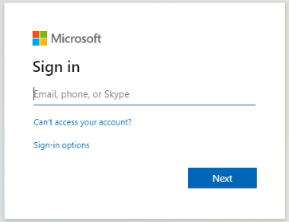
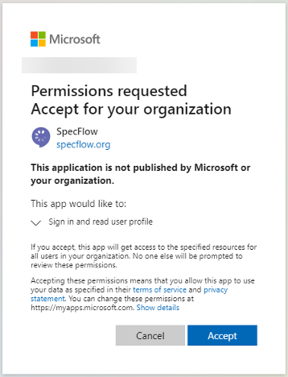

# Admin Consent (Azure AD)

## Overview

Please note this guide is for **Azure AD Administrators** only.

Depending on your organization's policy, users may not have the permission to create a SpecFlow account. As an admin you can construct a URL for granting tenant-wide admin consent to your organization's users. This guide is based on [Microsoft's documentation](https://docs.microsoft.com/en-us/azure/active-directory/manage-apps/grant-admin-consent#construct-the-url-for-granting-tenant-wide-admin-consent).

As per [Microsoft documentation](https://docs.microsoft.com/en-us/azure/active-directory/manage-apps/grant-admin-consent#construct-the-url-for-granting-tenant-wide-admin-consent) the tenant-wide admin consent URL follows the following format:

```` HTTP
https://login.microsoftonline.com/{tenant-id}/adminconsent?client_id={client-id}
````

where:

`{client-id}` is the application's client ID (also known as app ID).

`{tenant-id}` is your organization's tenant ID or any verified domain name.

SpecFlow's `{client-id}` is:

````
e3d07a6c-7ef6-48fe-bde7-6d8f0384cc9e
````

The `{tenant-id}` is unique to your organizations. [Click here](https://docs.microsoft.com/en-us/azure/active-directory/fundamentals/active-directory-how-to-find-tenant) to learn how to find your Azure Active Directory tenant ID.

## Example

1- Admin constructs the URL as per information provided above and replaces the `tenant-id` in the link with the [tenant-id of the organization](https://docs.microsoft.com/en-us/azure/active-directory/fundamentals/active-directory-how-to-find-tenant) e.g:  

```` HTTP
https://login.microsoftonline.com/{tenant-id}/adminconsent?client_id=e3d07a6c-7ef6-48fe-bde7-6d8f0384cc9e
````

2- Admin opens the link, and signs in as a user that is authorized to consent on behalf of the organization:



3- Consent is given by the admin for the organization to access the SpecFlow application by clicking *"Accept"*:



4- A *"Oh no! :("* message may pop up as per below, this is expected. Close the browser window.


5- Proceed to the **Enterprise applications** page in Microsoft Azure portal. You will see SpecFlow in the list of your applications. You can view further details here and enable your organization`s users to sign in and create SpecFlow accounts:


