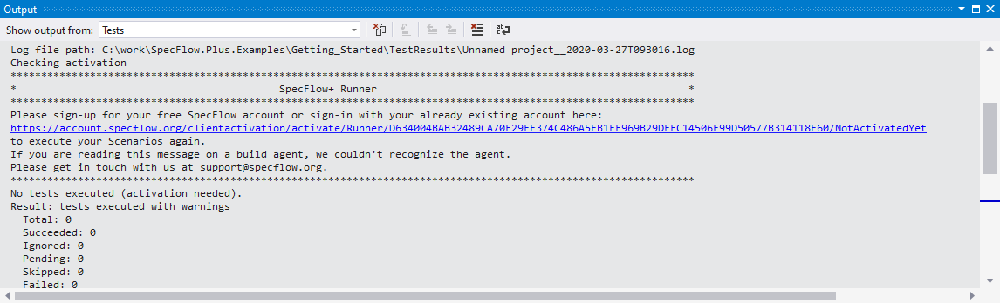
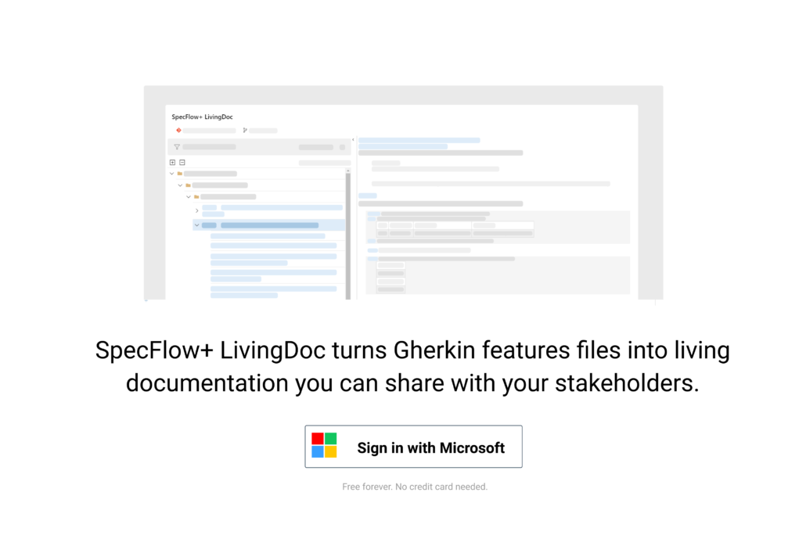

# SpecFlow Account

We have introduced a new license model for SpecFlow+ products. This new licensing model is **account-based** instead of requiring a license key. You need to sign up for a free personal SpecFlow account in order to use SpecFlow+ products.

## What are the benefits?

Signing up for a free SpecFlow account allows you to use the previously paid SpecFlow+ products for free. You no longer need to wait for us to process your request for a license manually and can expand your use of the software to more users as required. We also plan to offer exclusive additional benefits to help you boost your productivity and get the most out of SpecFlow.

## Requirements

In order to license SpecFlow+ and SpecMap with the new license model:

- A free Microsoft account is required. This can be your already existing personal or corporate/enterprise Microsoft Account. If you do not yet have a Microsoft account, you can [create one for free](https://account.microsoft.com/account).

- Access to the internet is needed from your work environment.

- If you previously purchased a license from TechTalk, the terms and conditions and privacy policy have changed following the [acquisition of SpecFlow](https://specflow.org/2020/tricentis-acquires-specflow/) by Tricentis. You will need to accept these new terms when signing up.

In order to migrate from an existing active SpecFlow+ or SpecMap license key to the new SpecFlow account follow the step-by-step instructions in our migration guide [here](https://specflow.org/2020/migrate-to-the-specflow-account/).

## Sign up for an account

Depending on the product you are using, the steps you need to take are different. If you are new to SpecFlow, start with our [step-by-step Getting Started](https://docs.specflow.org/projects/getting-started/en/latest/) and learn how to setup SpecFlow, SpecFlow+ Runner, and SpecFlow+LivingDoc.

### SpecFlow+ Runner

If SpecFlow+ Runner is unlicensed, a message is written to the console when you try to execute your tests with SpecFlow+ Runner. You will be asked to sign up for a SpecFlow account or to sign in with your existing account. To see this, you need at least version 3.2.13 of the SpecFlow+ Runner.

In Visual Studio it looks like this:

**1-** Open the URL from the message in your browser. In Visual Studio you can click the link while pressing the CTRL-key.

**2-** You are displayed with a “Welcome Page”. Click on **Sign in with Microsoft** to continue.

**3-** Sign in with your Microsoft account. It can be a personal or corporate/enterprise account. If you are already signed in to your Microsoft account, this should happen automatically – *you might need additional permissions from your Active Directory admin. Learn more about admin consents [here](https://docs.microsoft.com/en-us/azure/active-directory/manage-apps/configure-admin-consent-workflow)*

**4-** You will be taken to a setup page where you can set up your SpecFlow account. Enter your details to sign up for a free SpecFlow account.

**5-** After you finished the sign-up, return to your IDE and run your scenarios again.

**Important Note for Active Directory Approvals:** It might be possible, that your Active Directory admin needs to grant you and your team [permission to use the SpecFlow+ Runner](./adminconsent.md) due to your organizations’ Active Directory configuration. Learn more about admin consents [here](https://docs.microsoft.com/en-us/azure/active-directory/manage-apps/configure-admin-consent-workflow).

**Note for Build Agents:** These steps should not be necessary on a build server.

### SpecFlow+ LivingDoc

If you start SpecFlow+ LivingDoc without a valid license, you will be asked to sign in with your Microsoft Identity and set up your SpecFlow account. You can download SpecFlow+ LivingDoc from the Microsoft Marketplace [here](https://marketplace.visualstudio.com/items?itemName=techtalk.techtalk-specflow-plus).

To create your account:

**1-** Start SpecFlow+ Living Doc under *Overview | SpecFlow+ LivingDoc* in Azure DevOps.

**2-** Click on Sign in with Microsoft.

**3-** Sign in with your Microsoft account. It can be a personal or corporate/enterprise account. If you are already signed in, this should happen automatically – *you might need additional permissions from your Active Directory admin. Learn more about admin consents [here](https://docs.microsoft.com/en-us/azure/active-directory/manage-apps/configure-admin-consent-workflow)*

**4-** You will be taken to a setup page where you can set up your SpecFlow account. Enter your details to sign up for a free SpecFlow account.

**5-** Return to SpecFlow+ LivingDoc and refresh your browser.

**Important Note for Active Directory Approvals:** It might be possible, that your Active Directory admin needs to grant you and your team [permission to use the SpecFlow+ LivingDoc](./adminconsent.md) due to your organizations’ Active Directory configuration. Learn more about admin consents [here](https://docs.microsoft.com/en-us/azure/active-directory/manage-apps/configure-admin-consent-workflow).

### Do you have any further questions?

We want to make the transition as easy as possible.  If you have any questions or concerns, please take a look at our [FAQs](https://specflow.org/plus/documentation/FAQ/).
Are you new to SpecFlow? Start with our easy to follow [Step-by-Step Getting Started](https://docs.specflow.org/projects/getting-started/en/latest/) and learn how to setup SpecFlow, and the SpecFlow+ products.
